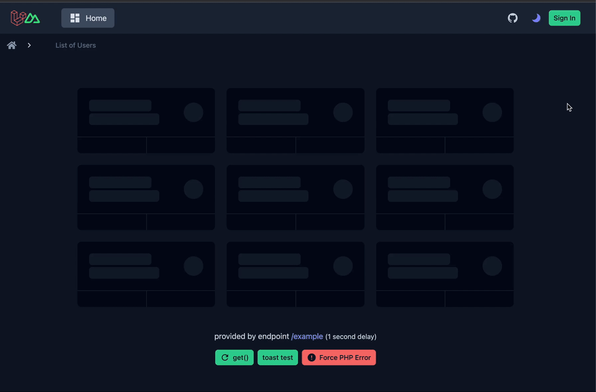

<p align="center">
  
</p>

## Laravel + Nuxt.js Boilerplate

> Now supporting [Nuxt v3](https://nuxt.com)


**Are you using Laravel with vapor? want your Nuxt setup on lambda as well? [TRY FUME!](https://fume.app)**


[](https://nuxt.com)
[](https://laravel.com)
[](https://madewithlaravel.com/p/laranuxt/shield-link)


[](https://github.com/fumeapp/laranuxt/actions/workflows/lint-js.yml)
[](https://github.com/fumeapp/laranuxt/actions/workflows/lint-php.yml)



> Examples on using Dark Mode, authentication, and listing data

### What is included

* [NUXT v3](https://nuxt.com) front end, a progressive Vue.js framework - For Nuxt v2 visit [this branch](https://github.com/fumeapp/laranuxt/tree/nuxt2)
  * [nuxt UI](https://ui.nuxt.com.com) a collection of components built by the NuxtJS team, powered by TailwindCSS
  * [Authentication library](https://github.com/fumeapp/laranuxt#api-and-authentication) to assist with user sessions and logging in/out
  * Example Authentication Middleware

* [Laravel](https://laravel.com) - for our API - `v9.40.0`
  * [Model Typer](https://github.com/fumeapp/modeltyper) - Generates Typescript interfaces from Laravel Models 
  * [MetAPI](https://github.com/fumeapp/metapi) - API helpers and utilities
  * [humble](https://github.com/fumeapp/humble) - Passwordless sessioning with detailed device and location
  * [debugbar](https://github.com/barryvdh/laravel-debugbar) - awesome debugbar for our API
  * [ide-helper](https://github.com/barryvdh/laravel-ide-helper) - Helper files to enable help with IDE autocompletion

### Installation

* clone from GitHub
* run `yarn` and `composer install` to install all of your deps
* copy `.env.example` to `.env` and configure it to your likings
* TL;DR
 ```bash
git clone git@github.com:fumeapp/laranuxt.git; cd laranuxt; yarn; c****omposer install; cp .env.example .env;
 ```
* Feel free to delete excess media in  `/resources/`


### Local Environment
* run `yarn dev` in one terminal for our nuxt dev setup
* run `yarn api` (alias for `./artisan serve`) in another terminal for our laravel API

### Api and Authentication

* Api and auth can be accessed via the provided `Api` library

```ts
const api = useApi()
console.log(api.$user.name);
```

#### Authentication

* Take a look at [HeaderLoginModal.vue](https://github.com/fumeapp/laranuxt/blob/main/client/components/header/HeaderLoginModal.vue#L143) to see how we pass the credentials to our library
```ts
  const redirect = await api.login(result)
  if (redirect) await router.push({path: redirect})
```
* Once logged on, you have the boolean `api.loggedIn` and the object `api.$user`
```html
  
```

#### API
The API class provides helper functions to easily retrieve, update, and remove data from your Laravel endpoints.  If you use and update [modeltyper](https://github.com/fumeapp/modeltyper) regularly you will always have completely typed results

* To get a listing/index of data, use `api.index`
```ts
const users = api.index<models.UserResults>('/user', { page: 1 })
```

* To get an individual by id, use `api.get`
```ts
const users = api.get<models.User>('/user/1')
```

* To update with an id, use `api.put`
```ts
const result = api.put<api.MetapiResponse>('/user/1', user)
```

* To store a new record, use `api.store`
```ts
const result = api.store<api.MetApiResponse>('/user', { name: 'Bob', email: 'bob@mail.com' })
```

* To delete with an id, use `api.delete`
```ts
const result = api.delete<api.MetApiResponse>('/user/1')
```
